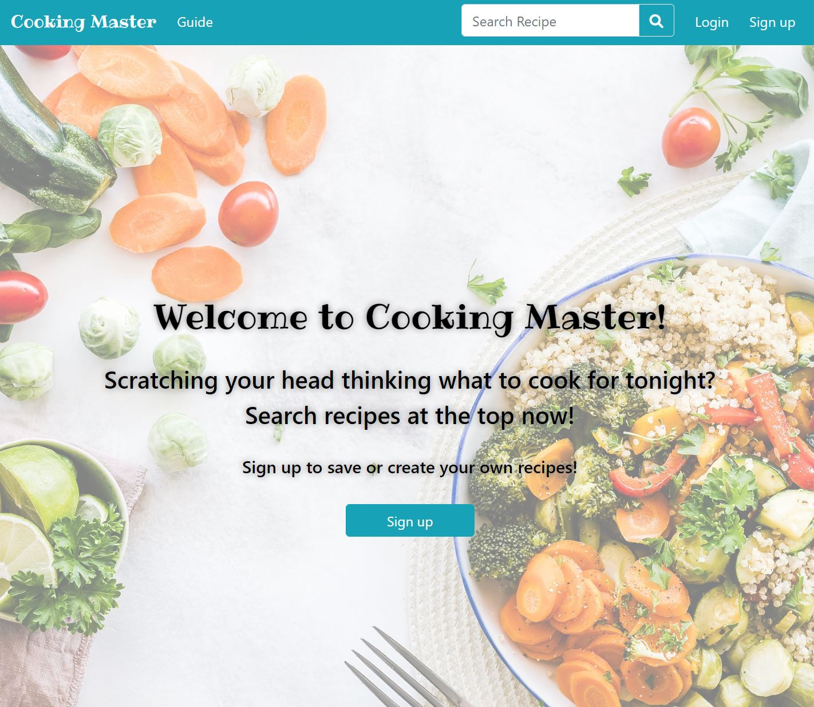

# Welcome!

### Hi there! Welcome to my Github

- 🔭 I’m currently learning and experimenting with Typescript 
- 🤔 I’m looking for help with getting a job as a Software Developer!
- 📫 Feel free to reach me on <a href="https://www.linkedin.com/in/christy-sn-wong/">LinkedIn!</a> 

&nbsp;

    

&nbsp;

# Featured Projects

&nbsp;

<table>
    <tr valign="top">
        <td width="33%" align="center">
            
<b>Weather Dashboard</b>

            
A site that enables users to view weather information at any cities

            
        </td>
        <td width="33%" align="center">
            
<b>Trivia Guru</b>

            
A site that enables users to take trivia quizzes and broaden knowledge

            
        </td>
        <td width="33%" align="center">
            
<b>Cooking Master</b>

            
A site that enables users to search and view thousands of recipes

            
        </td>
    </tr>
    <tr>
        <td width="33%" align="center">
            
<b>Pokemon Memory Game</b>

            
A site that allows users to test their memories and match Pokemon cards

            
        </td>   
    </tr>

    
</table>

&nbsp;

# Tech Stack

&nbsp;

⚡ **Frontend Languages**

  
  
  
  
  
  
  

&nbsp;

⚡ **Backend Languages**

  
  
  
  
  

&nbsp;

⚡ **Others**

  
  
  

